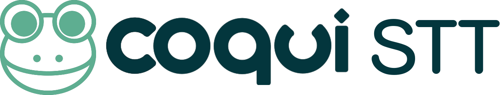

# 

DeepSpeech is an open-source Speech-To-Text engine, using a model trained by machine learning techniques based on [Baidu's Deep Speech research paper](https://arxiv.org/abs/1412.5567). Project :frog: STT uses  [TensorFlow](https://www.tensorflow.org/) to make the implementation easier.

Documentation for installation, usage, and training models are available on [deepspeech.readthedocs.io](https://deepspeech.readthedocs.io/?badge=latest).

For the latest release, including pre-trained models and checkpoints, [see the latest release on GitHub](https://github.com/mozilla/DeepSpeech/releases/latest)

For contribution guidelines, see [CONTRIBUTING.rst](CONTRIBUTING.rst).

For contact and support information, see [SUPPORT.rst](SUPPORT.rst).
