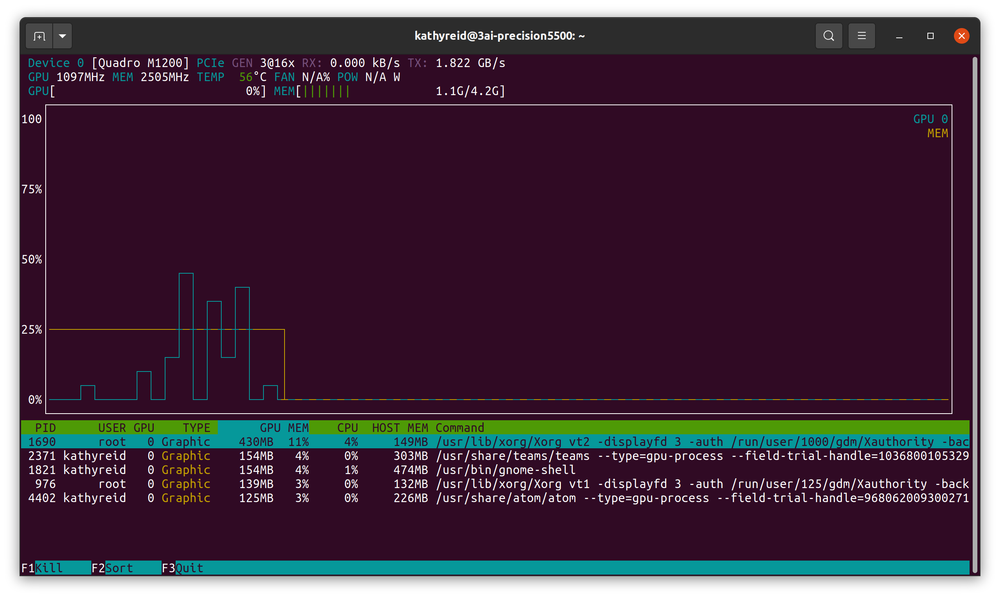

[Home](README.md) | [Previous - Acoustic Model and Language Model](AM_vs_LM.md) | [Next - Training your model](TRAINING.md)

# Setting up your environment for training using Coqui STT

## Contents

- [Setting up your environment for training using Coqui STT](#setting-up-your-environment-for-training-using-coqui-stt)
  * [Contents](#contents)
  * [Installing dependencies for working with GPUs under Docker](#installing-dependencies-for-working-with-gpus-under-docker)
    + [GPU drivers](#gpu-drivers)
  * [What is Docker and why is it recommended for training a model with Coqui STT?](#what-is-docker-and-why-is-it-recommended-for-training-a-model-with-coqui-stt-)
  * [Install Docker](#install-docker)
    + [Ensure that you create a `docker` group and that you add yourself to this group](#ensure-that-you-create-a--docker--group-and-that-you-add-yourself-to-this-group)
    + [Install the `nvidia-container-toolkit`](#install-the--nvidia-container-toolkit-)
  * [Pulling down a pre-built Coqui STT Docker image](#pulling-down-a-pre-built-coqui-stt-docker-image)
    + [Testing the image by creating a container and running a script](#testing-the-image-by-creating-a-container-and-running-a-script)
  * [Setting up a bind mount to store persistent data](#setting-up-a-bind-mount-to-store-persistent-data)
  * [Extending the base `stt-train` Docker image for your needs](#extending-the-base--stt-train--docker-image-for-your-needs)

This section of the Playbook assumes you are comfortable installing 🐸STT and using it with a pre-trained model, and that you are comfortable setting up a Python _virtual environment_.

Here, we provide information on setting up a Docker environment for training your own speech recognition model using 🐸STT. We also cover dependencies Docker has for NVIDIA GPUs, so that you can use your GPU(s) for training a model.

---

*** Do not train using only CPU(s) ***

This Playbook assumes that you will be using NVIDIA GPU(s). Training a 🐸STT speech recognition model on CPU(s) only will take a _very, very, very_ long time. Do not train on your CPU(s).

---

## Installing dependencies for working with GPUs under Docker

Before we install Docker, we are going to make sure that we have all the Ubuntu Linux dependencies required for working with NVIDIA GPUs and Docker.

---

*** Non-NVIDIA GPUS ***

Although non-NVIDIA GPUs exist, they are currently rare, and we do not aim to support them in this Playbook.

---

### GPU drivers

By default, your machine should already have GPU drivers installed. A good way to check is with the `nvidia-smi` tool. If your drivers are installed correctly, `nvidia-smi` will report the driver version and CUDA version.

```
$ nvidia-smi

Sat Jan  9 11:48:50 2021
+-----------------------------------------------------------------------------+
| NVIDIA-SMI 450.80.02    Driver Version: 450.80.02    CUDA Version: 11.0     |
|-------------------------------+----------------------+----------------------+
| GPU  Name        Persistence-M| Bus-Id        Disp.A | Volatile Uncorr. ECC |
| Fan  Temp  Perf  Pwr:Usage/Cap|         Memory-Usage | GPU-Util  Compute M. |
|                               |                      |               MIG M. |
|===============================+======================+======================|
|   0  GeForce GTX 1060    Off  | 00000000:01:00.0  On |                  N/A |
| N/A   70C    P0    27W /  N/A |    766MiB /  6069MiB |      2%      Default |
|                               |                      |                  N/A |
+-------------------------------+----------------------+----------------------+

+-----------------------------------------------------------------------------+
| Processes:                                                                  |
|  GPU   GI   CI        PID   Type   Process name                  GPU Memory |
|        ID   ID                                                   Usage      |
|=============================================================================| |                                                                             |
+-----------------------------------------------------------------------------+

```

If your drivers are _not_ installed correctly, you will likely see this warning:

```
$ nvidia-smi

Command 'nvidia-smi' not found, but can be installed with:

sudo apt install nvidia-utils-440         # version 440.100-0ubuntu0.20.04.1, or
sudo apt install nvidia-340               # version 340.108-0ubuntu2
sudo apt install nvidia-utils-435         # version 435.21-0ubuntu7
sudo apt install nvidia-utils-390         # version 390.141-0ubuntu0.20.04.1
sudo apt install nvidia-utils-450         # version 450.102.04-0ubuntu0.20.04.1
sudo apt install nvidia-utils-450-server  # version 450.80.02-0ubuntu0.20.04.3
sudo apt install nvidia-utils-460         # version 460.32.03-0ubuntu0.20.04.1
sudo apt install nvidia-utils-418-server  # version 418.152.00-0ubuntu0.20.04.1
sudo apt install nvidia-utils-440-server  # version 440.95.01-0ubuntu0.20.04.1

```

[Follow this guide](https://linuxconfig.org/how-to-install-the-nvidia-drivers-on-ubuntu-18-04-bionic-beaver-linux) to install your GPU drivers.

Once you've installed your drivers, use `nvidia-smi` to prove that they are installed correctly.

_Note that you may need to restart your host after installing the GPU drivers._

Ideally, you should not be running any other processes on your GPU(s) before you start training.

Next, we will install the utility `nvtop` so that you can monitor the performance of your GPU(s). We will also use `nvtop` to prove that Docker is able to use your GPU(s) later in this document.

```
$ sudo apt install nvtop
```

_Note that you may need to restart your host after installing `nvtop`._

If you run `nvtop` you will see a graph similar to this:



You are now ready to install Docker.

## What is Docker and why is it recommended for training a model with Coqui STT?

[Docker](https://www.docker.com/why-docker) is virtualization software that allows a consistent collection of software, dependencies and environments to be packaged into a _container_ which is then run on a host, or many hosts. It is one way to manage the many software dependencies which are required for training a model with 🐸STT, particularly if using an NVIDIA GPU.

## Install Docker

First, you must install Docker on your host. Follow the [instructions on the Docker website](https://docs.docker.com/engine/install/ubuntu/).

### Ensure that you create a `docker` group and that you add yourself to this group

Once you have installed Docker, be sure to follow the [post-installation](https://docs.docker.com/engine/install/linux-postinstall/) steps. These include setting up a `docker` group and adding your user account to this group. If you do not follow this step, you will need to use `sudo` with every Docker command, and this can have unexpected results.

---

If you try to use `docker` commands and constantly receive permission warnings, it's likely that you have forgotten this step.

---

### Install the `nvidia-container-toolkit`

Next, we need to install `nvidia-container-toolkit`. This is necessary to allow Docker to be able to access the GPU(s) on your machine for training.

First, add the repository for your distribution, following the instructions on the [NVIDIA Docker GitHub page](https://nvidia.github.io/nvidia-docker/). For example:

```
curl -s -L https://nvidia.github.io/nvidia-docker/gpgkey | \
  sudo apt-key add -
distribution=$(. /etc/os-release;echo $ID$VERSION_ID)
curl -s -L https://nvidia.github.io/nvidia-docker/$distribution/nvidia-docker.list | \
  sudo tee /etc/apt/sources.list.d/nvidia-docker.list
sudo apt-get update
```

Next, install `nvidia-container-toolkit`:

```
$ sudo apt-get install -y nvidia-container-toolkit
```

## Pulling down a pre-built Coqui STT Docker image

Once you have installed Docker and the `nvidia-container-toolkit`, you are ready to build a Docker _image_. Although it's [possible to build your own Docker image from scratch](), we're going to use a pre-built 🐸STT training image which is hosted on Docker Hub. Once the image is pulled down, you can then create a Docker _container_ from the image to perform training.

As you become more proficient with using 🐸STT, you can use the pre-built Docker image as the basis for your own images.

**Running this command will download several gigabytes of data. Do not perform this command if you are on a limited or metered internet connection**

```
$ docker pull ghcr.io/coqui-ai/stt-train:v0.10.0-alpha.4
v0.10.0-alpha.4: Pulling from coqui-ai/stt-train
Digest: sha256:0f8ee9208874a925618e527f1d06ea9065dd09c700972cba740884e7e7e4cd17
Status: Image is up to date for ghcr.io/coqui-ai/stt-train:v0.10.0-alpha.4
ghcr.io/coqui-ai/stt-train:v0.10.0-alpha.4
```

<!-- FIXME uncomment once we have CI publishing of these images:

If you do not which to use the `v0.9.3` 🐸STT image, [a list of previous images is available](https://github.com/orgs/coqui-ai/packages/container/stt-train/versions).

You will now see the `ghcr.io/coqui-ai/stt-train` image when you run the command `docker image ls`:

```
$ docker image ls
REPOSITORY                               TAG                  IMAGE ID       CREATED          SIZE
ghcr.io/coqui-ai/stt-train               v0.10.0-alpha.4      d145cb0930ea   37 minutes ago   5.12GB
``` -->

### Testing the image by creating a container and running a script

Now that you have your Docker image pulled down, you can create a _container_ from the image. Here, we're going to create a container and run a simple test to make sure that the image is working correctly.

_Note that you can refer to Docker images by `id` - such as `7cdc0bb1fe2a` in the example above, or by the image's name and `tag`. Here, we will be using the image name and `tag` - ie `ghcr.io/coqui-ai/stt-train:v0.10.0-alpha.4`._

```
$ docker run  -it --name stt-test --entrypoint /bin/bash ghcr.io/coqui-ai/stt-train:v0.10.0-alpha.4
```

The `entrypoint` instruction following `docker run` tells Docker to run the `/bin/bash` (ie shell) after creating the container.

This command assumes that `/bin/bash` will be invoked as the `root` user. This is necessary, as the Docker container needs to make changes to the filesystem. If you use the `-u $(id -u):$(id -g)` switches, you will tell Docker to invoke `/bin/bash` as the current user of the host that is running the Docker container. You will likely encounter `permission denied` errors while running training.

When you run the above command, you should see the following prompt:

```
________                               _______________
___  __/__________________________________  ____/__  /________      __
__  /  _  _ \_  __ \_  ___/  __ \_  ___/_  /_   __  /_  __ \_ | /| / /
_  /   /  __/  / / /(__  )/ /_/ /  /   _  __/   _  / / /_/ /_ |/ |/ /
/_/    \___//_/ /_//____/ \____//_/    /_/      /_/  \____/____/|__/


WARNING: You are running this container as root, which can cause new files in
mounted volumes to be created as the root user on your host machine.

To avoid this, run the container by specifying your user's userid:

$ docker run -u $(id -u):$(id -g) args...

root@d14b2d062526:/STT#
```

In a separate terminal, you can see that you now have a Docker image running:

```
$ docker ps
CONTAINER ID   IMAGE          COMMAND       CREATED              STATUS              PORTS     NAMES
d14b2d062526   7cdc0bb1fe2a   "/bin/bash"   About a minute ago   Up About a minute             compassionate_rhodes
```

🐸STT includes a number of convenience scripts in the `bin` directory. They are named for the corpus they are configured for. To ensure that your Docker environment is functioning correctly, run one of these scripts (in the terminal session where your container is running).

```
root@d14b2d062526:/STT/bin# ./bin/run-ldc93s1.sh
```

This will train on a single audio file for 200 epochs.

We've now proved that the image is working correctly.

## Setting up a bind mount to store persistent data

Now that we have a Docker image pulled down, we can create a _container_ from the image, and do training from within the image.

However, Docker containers are not _persistent_. This means that if the host on which the container is running reboots, or there is a fatal error within the container, all the results stored _within_ the container will be lost. We need to set up _persistent storage_ so that the checkpoints and exported model are stored _outside_ the container.

To do this we create a [bind mount](https://docs.docker.com/storage/bind-mounts/) for Docker. A _bind mount_ allows Docker to store files externally to the container, on your local filesystem.

First, stop and remove the container we created above.

```
$ docker rm -f stt-test
```

Next, we will create a new container, except this time we will also create a _bind mount_ so that it can store persistent data.

First, we create a directory on our local system for the bind mount.

```
$ mkdir stt-data
```

Next, we create a container and instruct it to use a bind mount to the directory.

```
$ docker run  -it \
  --entrypoint /bin/bash \
  --name stt-train \
  --gpus all \
  --mount type=bind,source="$(pwd)"/stt-data,target=/STT/stt-data \
  7cdc0bb1fe2a
```

We all pass the `--gpus all` parameter here to instruct Docker to use all available GPUs. If you need to restrict the use of GPUs, then please consult the [Docker documentation](https://docs.docker.com/config/containers/resource_constraints/). You can also restrict the amount of memory or CPU(s) that the Docker container consumes. This might be useful if you need to use the host that you're training on _at the same time_ as the training is occurring, or if you're on a shared host or cluster (for example at a university).

From within the container, the `stt-data` directory will now be available:

```
root@e964b1e5a60c:/STT# ls | grep stt-data
stt-data
```

You are now ready to begin [training](TRAINING.md) your model.

## Extending the base `stt-train` Docker image for your needs

As you become more comfortable training speech recognition models with 🐸STT, you may wish to extend the base Docker image. You can do this using the `FROM` instruction in a `Dockerfile`, for example:

```
# Custom Dockerfile for training models using 🐸STT

# Get the latest 🐸STT image
FROM ghcr.io/coqui-ai/stt-train:v0.10.0-alpha.4

# Install nano editor
RUN apt-get -y update && apt-get install -y nano

# Install sox for inference and for processing Common Voice data
RUN apt-get -y update && apt-get install -y sox

```

You can then use `docker build` with this `Dockerfile` to build your own custom Docker image.

---

[Home](README.md) | [Previous - Acoustic Model and Language Model](AM_vs_LM.md) | [Next - Training your model](TRAINING.md)
